# Slice of Pie!

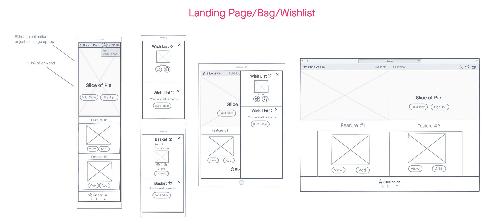

## Code Institute's Milestone Project 4 - Full Stack Frameworks

Slice of Pie is the brainchild of Zoe Thexton, who produces custom triangular tables that fit seamlessly into any section of a person's living or bedroom. Designed using CAD software, the tables can be assembled by hand in a variety of sizes, types of wood, and number of shelving levels. The inspiration for this product came from the need to get creative with the limited space available in her own living room (and generally missing somewhere to put a cup of tea down as a result of this!), while the product's name comes from the triangular shape of the finished design. The only thing missing now is a means to sell this innovative product to consumers, so I offered to develop and build an e-commerce store capable of displaying the product range and accepting secure payments for orders. My aim for this project is to create a site that allows potential customers to browse all available designs or build their ideal table using a product builder, while allowing administrators to manage the products by adding, editting, or deleting SKUs when required.

This project is the fourth and final of four 'milestone' projects which are required to complete the Code Institute's diploma in full stack web development. Assessment criteria for this milestone project focuses on the ability to produce a full-stack e-commerce store with secure Stripe payments built using the Django Python framework alongside HTML, CSS and JavaScript to control a centrally-owned datatset.

You can view the live site [here](https://slice-of-pie.herokuapp.com/), and a link to the GitHub repository can be found [here](https://github.com/franciskershaw/slice-of-pie).

## Table of Contents
* [UX](#ux)
    * [User Stories](#user-stories)
* [Planning and Design](#planning-and-design)
    * [Strategy Plane](#strategy-plane)
    * [Scope Plane](#scope-plane)
    * [Structure Plane](#structure-plane)
    * [Skeleton Plane](#skeleton-plane)
    * [Surface Plane](#surface-plane)
        * [Colour Scheme](#colour-scheme)
        * [Typography](#typography)
        * [Animations](#animations)
    * [Data Model](#data-model)
* [Features and Django Apps](#features-and-django-apps)
* [Existing Features](#existing-features)
* [Defensive design features](#defensive-design-features)
* [Features left to implement](#features-left-to-implement)
* [Technologies used](#technologies-used)
    * [Languages and frameworks](#languages-and-frameworks)
    * [Additional tools](#additional-tools)
* [Git commit messages](#git-commit-messages)
* [Testing](#testing)
* [Deployment](#deployment)
* [Setting up AWS](#setting-up-amazon-web-services-aws)
* [Setting up Emails](#setting-up-email-confirmations)
* [Cloning](#cloning)
* [Credits](#credits)
    * [Media](#media)
    * [Acknowledgements](#acknowledgements)  

  
## UX

My main goals for the creation of this website were as follows:

* To create an ecommerce store where my client can sell a novel concept to the public.
* Design the site in a way that makes the user’s journey from visit to checkout as pleasant as possible.
* Demonstrate my new found skills applying Django as an MVC framework in order to pass this final part of the course and obtain my Diploma.

### User Stories

#### Developer

As the software developer building the store:

1. I want to create a full-stack online shop on which users can browse and securely make purchases, and site admins have control to add, edit or delete items from the site so that I can pass this part of the course.
2. I want this project to look as aesthetically pleasing as possible so that my final project of the course is the most impressive and displays my progress.

#### Site owner/administrator

As the owner of the site, or as an administrator:

1. I want to have admin access allowing me to add, edit, delete, and amend the availability of products on my online store so that I can keep my product range up to date.
2. I would like users to be unable to purchase unavailable products so that I don’t have to go through a refund process.
3. I want users to have a product builder which allows them to feel like they are custom building their product as per their preferences so that my store stands out aesthetically compared to competitors.
4. I want the site to be as aesthetically pleasing and intuitive as possible so that users are left with a positive emotional response to their visit and are more likely to make a purchase.

#### Users

As a user/prospective customer:

1. I want to be able to browse available products so that I can see if there’s anything I want to buy.
2. I would like to be able to easily filter and sort products by a range of parameters so that I can quickly find what I am looking for.
3. I want to see clearly if certain products are not available so that I don’t waste my time putting them in my basket
4. I want to be able to add a product to my basket and then keep on browsing or proceed to checkout.
5. I want to be able to remove or amend the quantity of products in my basket easily so that I have the power to change my mind during my journey.
6. I would like to receive visual feedback at every stage of my journey when I perform actions, so that I am sure what I intended to do has in fact taken place.
7. I want to be able to pay securely without creating an account so that I don’t need to have my details saved.
8. I would like to register for an account so that I can save my payment details, and see my order history so that my journey on the site is made easier.
9. As an account holder, I would like to be able to save products in my favourites so that I can decide later whether to proceed with my purchase.
10. As an account holder, I would like to be able to save my delivery details so that checkout is faster during my next purchase.
11. As an account holder who has saved their details, I would like to make amends to my saved delivery address so that I can ensure this information is updated accurately.
12. At checkout, I would like the payment process to be simple and intuitive so that I don’t waste any time during my journey
13. At checkout, I would like to be sure that my details are secure during the payment process so that I don’t feel like I’m taking any risks with my money.
14. After checkout, I would like to receive an order confirmation both on my screen and in my emails so that I can review the purchase and make sure that everything occurred as it was supposed to.

## Planning and Design

### Strategy Plane

The **user stories** as detailed above were the first stage of strategising for the project and are at the forefront during every stage of development. Features that are not in service of the user stories were not considered during the creation of this project.

The **focus** of the project is:
* To create a fully functioning online store that allows the site owner to sell small bespoke tables, on which new products can be added and old products can be removed.

The **business goals** of the stakeholder are:

* To sell as many products as possible.
* Encourage users to return for future browsing and purchases.
* Have a store that can have products added to it and removed so that the product selection remains fresh.

*Therefore, a bespoke website using a full stack framework is required to meet the focus and business goals as it is the only way within my current skillset to produce an e-commerce store that is both aesthetically pleasing and contains the necessary features to allow users to browse and checkout securely, with administrators also able to manipulate the backend when needed.*

At this early stage of planning, it was time to begin researching potential competitors online to get ideas about what features and style choices are prerequisites for an e-commerce store to be successful. As I believe the product being sold is quite novel, I searched mainly for 'quirky' furniture stores that might lead me in the right direction when making decisions later on.

The following sites stood out to me and provided inspiration for certain stylistic choices and features that could be implemented:

* [Rockett St George](https://www.rockettstgeorge.co.uk/furniture/collections.html)
* [Not on the Highstreet](https://www.notonthehighstreet.com/home/furniture)  
* [Audenza](https://www.audenza.com/furniture)

Using the below importance vs viability metric, I listed out all of the opportunities on offer when building this site to help me decide what was achievable, relevant and appropriate with regard to my user stories.

| Opportunity                                 | Importance | Viability
| --------------------------                  | ---------- |-----------
| 10% offer for signing up                    | 2          | 3
| Sign-up to email updates                    | 3          | 3
| Free shipping for ordering a certain amount | 2          | 4
| Animation when you hover over a product     | 3          | 5
| Animation when you hover over a product     | 3          | 5
| ‘New’ label for new products                | 2          | 5
| Product builder                             | 4          | 3
| Blog                                        | 1          | 3
| Register/sign in option                     | 4          | 4
| Heart icon to save for later                | 3          | 4
| Search bar                                  | 2          | 4
| Filtering of products                       | 5          | 3
| **Total**                                   | **34**     | **46**

At this stage, I felt confident that the features I had in mind for the creation of this site would be mostly viable when compared to their relevant importance to the project. However, it was clear very early on that there were a couple of common e-commerce features that were surplus to requirements for this particular store and would not need to be included:

* Search bar - the site is essentially selling one type of product with different customisations available to it, so there is not an awful lot the user will likely want to search by. Advanced filtering and sorting is a far more logical method for the user to navigate the site.
*  Blog - this is unnecessary for the requirements of version 1 of the project, but could be an interesting feature to include on a future iteration of the site.
* 10% offer for signing up - this is slightly beyond the scope of this project, but again could well be something to pursue on a later version of the site.

### Scope Plane

Based on research and planning achieved during the strategy plane, and considering any limitations of my current coding abilities, the features I decided were critical for the completion of my user stories were as follows:

#### Required functional specifications

* Registration and login capability, so that details and preferences can be saved.
* Admin ability to manage content via the frontend.
* Featured products on the homepage that can be editted by the administrator.
* Product builder, which will basically be an advanced filter.
* Product details for individual products.
* Ability to simply browse all available products and apply filters.
* Add, remove or amending the shopping cart.
* Profile page for favourites and order history (if logged in).
* Secure checkout and payment.
* Free delivery for reaching a certain threshold

#### Content requirements

* Ability to request new password if the user has forgotten.
* Admin control should allow for CRUD capability on listed products.
* Product builder needs to be aesthetically pleasing and seamless to the user journey.
* Checkout must offer ability to save details for later (if logged in) or guest checkout for those that do not wish to create an account.

#### Nice to haves

I felt at this stage that the above features would contribute to a well rounded and functioning final product, but listed out some features that would be great to include if there was time:

* Create an account using social media.
* FAQ or about section to both give the seller a profile and explain what the product is and who the site owner is.
* Sign up to mailing list form.

### Structure Plane

With the functional specifications and content requirements nicely ironed out, I concluded that I would need the following pages or Django apps in order to allow users the most seamless journey across the site as possible:

1. **Homepage, containing:**

* Hero image which captures the tone of the site and introduces the user to what is being sold.
* The name of the site and calls to action directing the user to the ‘build your table’ and ‘create account’ sections of the site.
* Featured products just beneath the fold, split into two sides of the screen. Each box has an image of the product and a ‘view’ button. First one could be the basic or flagship product (which is the cheapest available table), and the second one could be the most premium offering.
* A brief about section to provide slightly more context for any organic visitors.

2. **Registration/login/password reset forms, containing:**
* Login or registration form.
* Feedback if field are incorrectly populated.
* Option to switch from register to login, or vice versa.
* Forgot password option on login form.
* Confirm email address after logging in.
* (Bonus) Ability to sign in using social media.

3. **Product builder page, containing:**
* Entry and disappear animations that present the options available to build a table step by step, starting with choice of sizes, folowed by number of shelves, and finally the type of material.
* Options which appear and disappear as per the users input.
* The selection of the final parameter directs the user to the individual product detail page.

4. **All products page, containing:**
* Conventional square boxes structure as per most e-commerce stores, containing product images, descriptions, prices, 'view' buttons', and a heart which would add the product to the user's wishlist.
* Option to sort by price, amount of shelves, and size.
* Option to filter by certain size of table, amount of shelves, or material.

5. **Product (detail) page, containing:**
* Larger version of the product image.
* Title and price per unit of the product.
* Quantity buttons, the default being 1 with the option to increase or decrease quantity accordingly.
* Add to basket or wish list buttons.
* Dimmed and disabled buttons if the product is unavailable.

6. **Bag and wishlist sidebars across each page, containing:**
* Bag items can be increased or decreased in quantity, or removed entirely.
* Items in wish list can be added directly to the basket, or removed.
* Checkout option directly from the bag, or a message saying 'Your bag is empty' if there is nothing in there.

7. **Checkout page, containing:**
* A summary of what is about to be ordered, with the ability to edit or remove these products from checkout at this late stage.
* Form with personal details and delivery details, which can be saved by the user if they want to and are logged in.

8. **Product management page for administrators only, containing:**
* A simple form to add products onto the site, update them, or delete them if required.
* 'Unavailable' option so that products can be made out of stock.

#### Interaction Design

* The site needs a nonlinear structure through the use of a fixed navigation bar which allows users to choose what section of the site they can jump to.
* A consistent footer across all pages can display the logo, copyright information and social links (if any exist).
* User feedback is required at various stages of their journey, such as:
    * When hovering over links.
    * Feedback message when any user actions pertaining to the bag or wish list through use of toasts.
* The same colour scheme and design choices are needed across all pages to maintain consistency.
* Where applicable, content should be viewable just beyond the fold so users know they can continue to scroll.

#### Information Architecture

* Tree structure can be implemented with use of burger icon on mobile devices.
* Priority of links from left to right
* Priority as follows: logo on far left, then in the middle is ‘build table’ and ‘browse all’, far right is ‘Sign in/sign out’, ‘wish list’, ‘basket’
* Most important CTAs should be visible on landing page: ‘build product’ or ‘create account’
* Where possible there should be no more than three clicks for a user to reach end of journey (if applicable) 

### Skeleton Plane

At this point in development, it felt safe to start serious work on wireframes. These were created using [InVision](https://www.invisionapp.com/), and were incredibly useful in ironing out any potential design flaws before any line of code has been written.

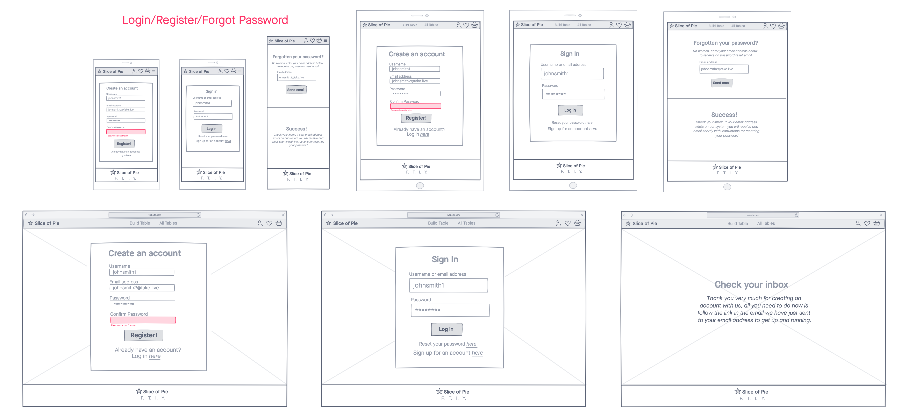

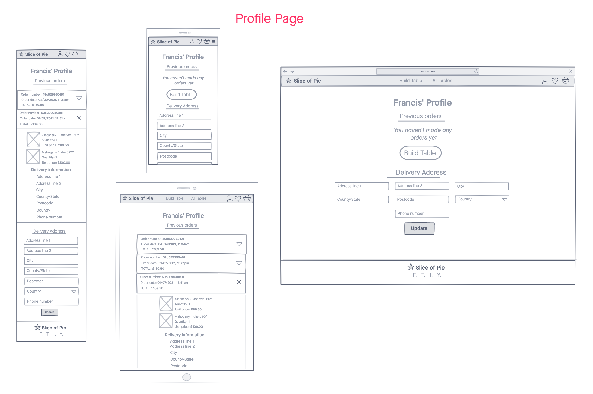

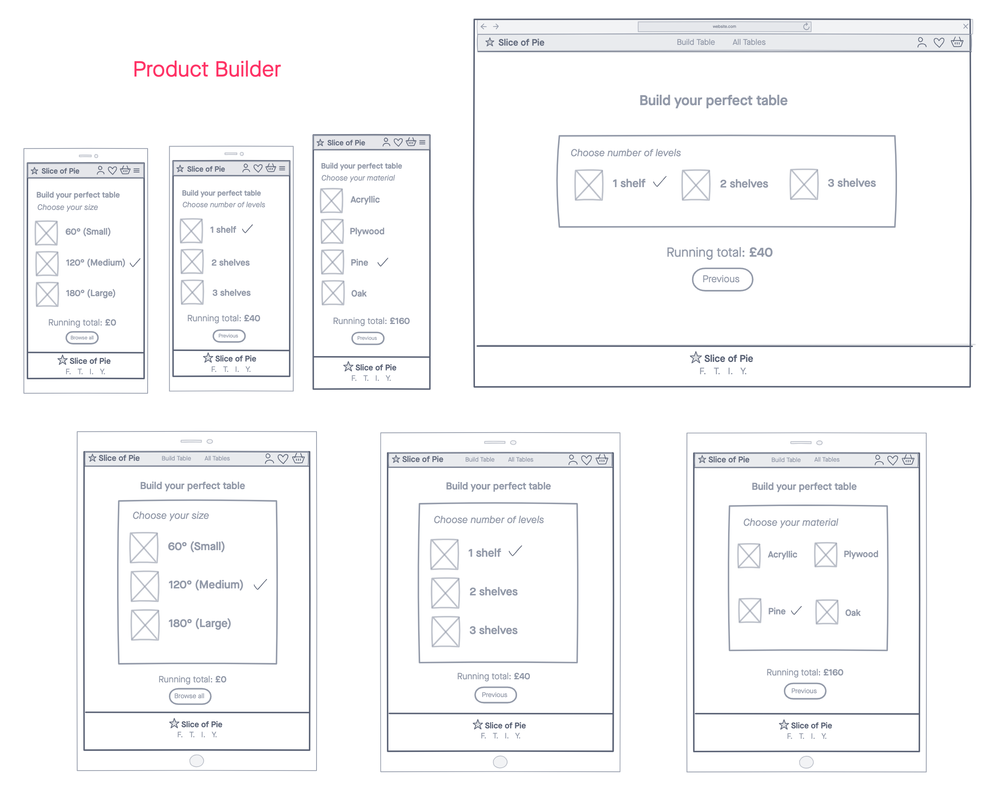

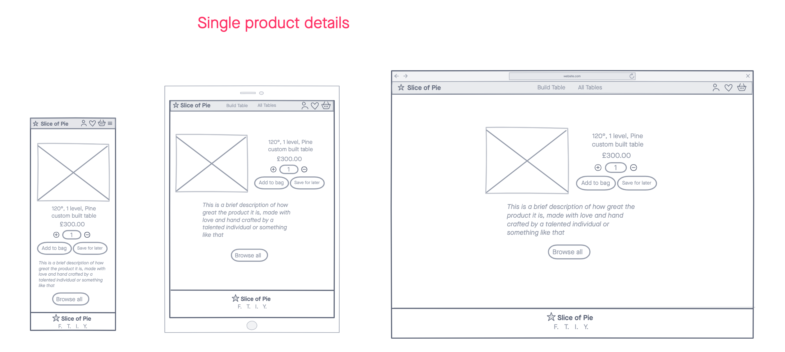

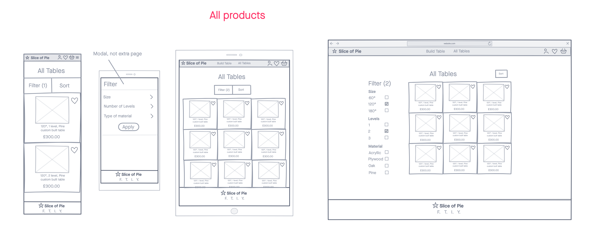

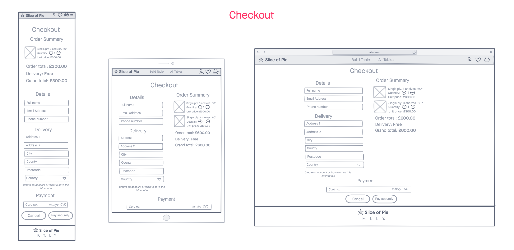

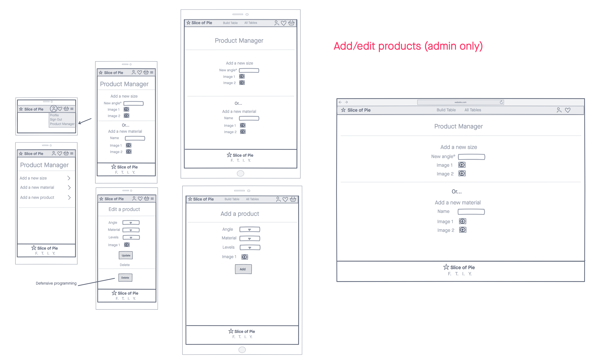

### Surface Plane

Once wireframing was complete, it was time to start thinking seriously about how the Front End of the website should be approached in terms of 'look and feel'. I asked Zoe for some key words that she'd like to have associated with a website that she owns, and we settled on the follwoing:

* Modern
* Nature
* Innovative
* Homemade

These words would help inform some of the trickier aesthetic choices to be made with the site from this stage of development.

#### Colour Scheme

After combining the key associative words with the colour pallette generator found on Coolors, I settled on the following colour scheme for the website:

* #e7e0da (off white)
* #ab793f (copper)
* #7d1224 (burgundy)
* #14223d (dark blue)
* #111a2c (rich black)

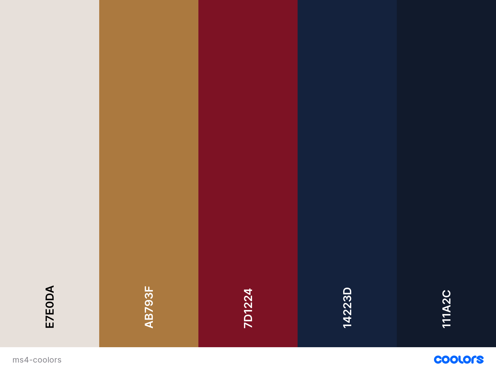

#### Typography

As the general feel of the site needed to feel professional and modern, plenty of existing fonts could be easily ruled out of contention out of the bat. In the end I settled on the Varela Round font from Google Fonts, as it was noted that the rounded edge of the lettering mirrors the tables that are on sale nicely.

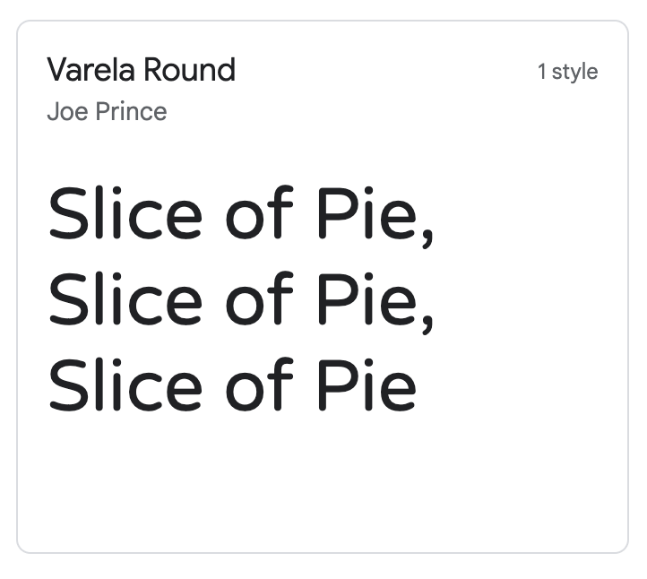

#### Animations

I set out at the beginning of development with the intention of implementing all of the following animations to aid the user experience:

* Change of image, or a zoom effect whenever a product is hovered over - be it on the homepage, product builder, or all products page.
* The product builder feature will rely heavily on entry and exit animations for the various stages of the product building process.
* Custom loading animations for when a page might take a while to load.

### Data Model

#### Conceptual Design Phase

A basic map of how I could get my various entities to interact with each other on a conceptual level was created as the below flowchart:

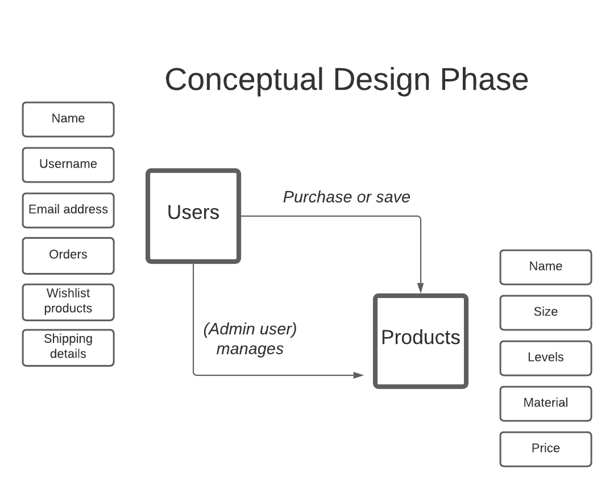

#### Logical Design Phase

The finalised way my collections work would together on the backend is best illustrated by the below entity relationship diagram:

(screenshot)

#### Physical Design Phase

MySQL is the database in use for the development environment on this project, while PostgreSQL is the database used for the live site through deployment on Heroku.

#### Data models

**Product model**
* SKU
* Name
* Size
* Levels
* Material
* Price
* Image 1
* Image 2
* Unavailable - true or false.

**Size/angle model**
* Name
* Friendly name
(COULD ADD IN S/M/L AS AN ALTERNATIVE THING HERE)

**Levels model**
* Name
* Friendly name

**Material model**
* Name
* Friendly name

## Apps and Features

### Existing Features

#### Consistent across all pages

* A fixed navigation bar appears on everyth page with the logo and brand on the far left, the main site features in the middle, and interactive icons on the far left for the user's profile, wishlist, and shopping basket. The options present within the profile icon changes depending on whether a user is signed in, or whether a user is an admin user.

(Screenshot here)

* In mobile, the main navigation items collapse into a conventional burger icon, while the name of the site disappears in order to save space on the smaller screen size.

(Screenshot here)

* The footer also remains consistent across all pages, containing the logo, site name, and links to external social media sites.

(Screenshot here)

* All interactable content (like buttons and links) contain hover properties that indicate the user can click on them, while feedback from certain actions (such as adding or removing items from your basket or wishlist) is presented to the user via Bootstrap's toast components.

#### Homepage

* The homepage contains a hero image of a living room table with a plant and a teapot on it, which was chosen for its relaxed tone. The brand name, tagline and two main calls to action appear in the hero section. The calls to action will differ depending on whether a user is signed in, display 'Sign Up' if the user is not logged in instead of 'All Tables'

* The content of the page appears through a staggered entry animation, which should mask the loading time on the main hero image for most devices.

* Just beneath the fold, the user should be able to see the featured tables section which directs the users to the 'Most Popular' offering (in actual fact, the cheapest table the site has to offer) and 'Recommended' (which happens to be the most expensive product on offer).

* A brief about section explaining the point of the site for those who have continued scrolling follows the featured section, containing one final call to action to direct users to the Table Builder page.

#### Login and registration

* Using Django's allauth plugin, the users can securely create new accounts and sign back in with either their email address or username.

#### Profile

* For users that have created their own personal accounts, they have access to a unique profile page that houses their delivery information and previous order history. I decided early on in the process to house all relevant order information in one convenient place by using Bootstrap's accordian feature to hide and reveal the order information interactively.

#### All products page

*Note: as the real life product is still currently in development, the product images had to be computer generated to provide as close a depiction to the final products as possible. This is mentioned in the product descriptions, however the intention is very much that on a future iteration of the site there will be professional grade photos taken to improve the overall aesthetics of the site and provide more useful refernces for the customers.*

* The all products page is styled much like any conventional e-commerce store, with an option to filter or sort the products by preference. 

* Hovering over the product images products a slide animation, displaying an alternative image for the user.

* On smaller screen sizes the filter option becomes an offscreen element that slides down from the top if the user presses the button.

* For users that have scrolled down, there is an option to return the user back to the top.

#### Product builder

* The main feature I wanted to push with this site was the interactive product builder, which essentially functions as an advanced filter for all the products in the database. The user is led on a journey whereby they think they are putting together a table based off of their own preferences, whereas information is actually being gathered through JavaScript to determine the product that they wish to browse.

* The choices come into and out of frame through animations to improve the emotional response to this feature.

#### Product detail page

* The product detail page, which is the end point from both the product builder and browsing the all products page, contains a larger version of the products images box, alongside options to choose the quantity of the product or save a product in the wishlist for later, and a description of the product being viewed.

* A randonly generated set of products appears beneath in order to provide more content and other options for the user to browse.

#### Basket and wishlist

* I decided early on that I wanted the basket and wishlist features to be sidebars so that users could access them wherever they were on the site. On mobile, these sidebars take up the entire viewport of the device, but anything above tablet size would only cover up a small portion of the screen.

* Users are able to conveniently move items from their wishlist directly into their basket during their session.

#### Checkout

* The checkout app uses Stripe payments to securely take payment from prospective customers.

* The view provides one section for delivery and payment details, and one section which summarises the order so that users are double sure of what they are purchasing.

* There is also an option to save delivery details to the profile for those users who have created an account and are signed in.

* A confirmation email is sent out to the users once the payment is complete so that they have a record, and the order is then added to their profile page.

* Stripe webhooks are also fully functioning in order to properly capture any orders that might go wrong during the checkout process from a user perspective.

#### Profile page

* The profile page provides signed in users with the option to update their delivery details and peruse former orders.

* All previous order information is hosued in accordion components to save space on the browser screen.

* If ther user has not yet placed an order, there is a call to action directing them to the product builder so that they may begin their customer journey.

### Defensive design features

(Intro to section)

#### On the frontend

#### On the backend

*Custom 404 and 500 pages were created as well*

### Features left to implement

## Technologies used

### Languages and frameworks

* **HTML5:** Language used for structure and content across all pages.
* **CSS3:** Language used to style elements from the HTML pages.
* **Bootstrap:** CSS and JavaScript framework which allowed for the quick implementation of the homepage modals and the grid system which greatly improved the responsiveness of each page.
* **JavaScript:** Programming language used to add interactivity to the homepage and implement the logic required to make the game work.
* **jQuery:** JavaScript framework which helped me select and manipulate elements with greater ease than purely through JavaScript.
* **Python:** Backend language used to control the logic on the site.
* **Flask:** Python framework used to simmplify the routing and HTML templating on the site.
* **MongoDB**: Non-relational database used to store and update the information provided by users of the site.

### Additional tools

* [Amiresponsive:](http://ami.responsivedesign.is/) Used to produce the hero image in README.md and check general responsiveness of the pages.
* [dbdiagram:](https://dbdiagram.io/home) Used to create my entity relationship diagram.
* [Favicon Generator:](https://realfavicongenerator.net/) Used to create the favicon on the browser tab.
* [FontAwesome:](https://fontawesome.com/) Large database of icons which I used all over the site to add to the visual language.
* [Free Formatter:](https://www.freeformatter.com/html-formatter.html) Used to help ensure code was consistently formatted across all files.
* [Github:](https://github.com/) Version control and storage of my code.
* [Gitpod:](https://gitpod.io/) Development environment where all the code was written.
* [Google Docs:](https://docs.google.com/) Used for note taking and was where much of my readme was initially written.
* Google Developer Tools: Used for debugging and testing of responsiveness across several screen sizes. Also vital to the testing of JavaScript functions as and when they were created.
* [Google Fonts:](https://fonts.google.com/) Provided my site with the 'Nunito' font.
* [InVision:](https://www.invisionapp.com/) Used to create all of my wireframes at the beginning of the development process.
* [JSHint:](https://jshint.com/) Checked my javascript code was valid and error free.
* [PEP8Online:](http://pep8online.com/) Confirmed that my Python code complied to PEP8 standards.
* [TinyJPG:](https://tinyjpg.com/) Service used to compress background images and help with site performance
* [Trello:](https://trello.com/) Used to split all tasks into several sprints, to help bring the development process in line with agile principles.
* [W3C CSS Validation Service:](https://jigsaw.w3.org/css-validator/) Confirmed that my CSS is legal.
* [W3C Markup Validation Service:](https://validator.w3.org/) Confirmed that my HTML code is legal.
* [WAVE:](https://wave.webaim.org/) Allowed me to evaluate and test the accessibility of the site.

## Git commit messages

For the commits on this project, I continued to follow the basic rules I had set during my three previous milestone projects. That is to say:

* Always use the imperative tense so that readers would read as *the purpose of this commit is to* - etc.
* Commit often, and keep messages as short as possible.
* Start comments where possible with a prefix that summarises what the commit is for, such as fix (for bugs), add, remove, amend, style, or docs (for anything added to README.md).
* Include the file name or function in question where possible.
* Use the prefix 'logic:' in any commits aimed at amending or adding in something that was specifically related to backend logic.
* Use the prefix 'test:' for any commits that were being pushed specifically to test bug fixes onto the live site.

At the time of writing, these are among my recent commit messages and illustrate the format I applied for this project:

## Testing

Please see a full report of the testing applied to this project [here.](testing.md)

## Deployment

## Setting up Amazon Web Services (AWS)

## Setting up email confirmations

## Cloning

## Credits

* Code for the navigation bar was sourced and then tweaked to spec from [this helpful blog post](https://www.aleksandrhovhannisyan.com/blog/responsive-navbar-without-bootstrap/) by Aleksandr Hovhannisyan

* Help customising checkboxes pulled from [this helpful article](https://www.html5canvastutorials.com/blog/2012/06/custom-form-radio-checkbox/) by Roy Saurav

* Help getting a random product for the product detail page's recommended products from [this helpful article](https://books.agiliq.com/projects/django-orm-cookbook/en/latest/random.html)

### Media

* Hero image: https://unsplash.com/photos/iLFOK7ntmgs
* About image: https://unsplash.com/photos/wSBL_x4R-Io

### Acknowledgements

A huge thank you to all the people who took part in user testing, the Code Institute's Slack community, and my mentor Aaron Sinnott for advice at various stages during development of the site.

#### Bugs

Stripe: typos in my webhook handlers caused 500 errors
Navbar: profile button dropdown stopped working (was because navbar-links had overflow set to hidden)
500 server error when removing items from wishlist (had same class name as basket which meant an undefined variable was in the url)