# Testing

Click [here](README.md) to return to the main project documentation.

Testing of this project was carried out through the following methods:

* Constant review during development using Gitpod's browser previewers and Chrome developer tools.
* User testing of the deployed site when close to completion.
* Manual user story testing during and after the writing of the code.
* Automated unit testing of the order form.
* Automated testing of the HTML and CSS files using the WC3 validators.
* Automated testing of the JavaScript and Python files using JSHINT and PEP8 Online respectively.
* Automated testing of the site's accessibility using the WAVE accessibility tool.
* Automated testing of the site's general performance through Google's lighthouse feature.

As per my previous projects, I attempted to stick to agile principles by using Trello to make sure that the project was first built to its most simple iteration - breaking large sections of the code to be written into sprints, with those sprints further broken up into individual tasks to be completed. Each completed task would then usually be assigned to its own git commit so that I had the option to revert to working versions of the code if my site was to break for an unknown reason.

## Table of Contents

* [Testing During Development](#testing-during-development)
   * [Browser Preview and Chrome Developer Tools](#browser-preview-and-chrome-developer-tools)
   * [Post Deployment](#post-deployment)
   * [Notable Bugs](#notable-bugs)
* [User Story Testing](#manual-user-story-testing)
* [Stakeholder Story Testing](#manual-stakeholder-testing)
* [Developer Testing](#manual-developer-testing)
* [Automated Order Form Test](#automated-order-form-test)
* [HTML Validator](#html-validator)
* [CSS Validator](#css-validator)
* [JS Validator](#js-validator)
* [PEP8 Compliance](#pep8-compliance)
* [Accessibility Testing](#accessibility-testing)
* [Google Lighthouse](#google-lighthouse)

## Testing During Development

### Browser Preview and Chrome Developer Tools

Visuals/Responsiveness

* By running ` python3 manage.py runserver `, I was able to constantly test the front end visuals of the site in order to make sure that elements and styles were being displayed as intended.
* While on the temporary browser previews, Google Chrome's developer tools were always in use to check the responsiveness of my pages across a number of screen sizes.

Logic

Following on from my previous projects, I made sure I continued with the process I had settled on when developing both the JavaScript functions and the Python back end logic for my site - that is to say start small and build up, making sure to check the console and print statements at all stages to ensure that the right results are being reached. Environment variables were also used to ensure that none of the sensitive secret keys were pushed to GitHub. *Note, I did at one point early on in development I did accidentally push my Postgres url to GitHub - however I replaced it with a new one by the end to ensure the security of the project was not compromised.*

I started by building the most basic version of the back end, with placeholders providing the bare minimum content required to have a functioning site on the front end. This allowed me to focus fully on getting all of the core back end logic working properly as the scope of this project and Django in general is so large. Only once I felt confident that all of my apps were working properly, and that the complicated process of deploying and linking to AWS was complete, did I fully focus on building out the front end of the site.

There were inevitably several interesting bugs that needed attention throughout the development of this project, for more information please see the 'notable bugs' section further down the document.

### Post Deployment

As this project depended almost entirely on the ability of prospective paying customers to interact with the website and complete purchases, it was particularly important to get feedback from user testing. With that in mind, I sent the live version of the website to 10 people with the following directives, leaving out specific instructions of *how* to achieve what the site could do to check that it was intuitive enough:

1. Create an account, confirm email address, sign back in.
2. Build a table.
3. View other tables that you haven't built.
4. Attempt to purchase a table using the dummy payment information provided by Stripe
5. Provide me with general feedback and let me know what device and browser was being used.

This defined structure for user testing helped me focus my testers to test the integral parts of the site and answer the following questions:

1. Is my site intuitive enough to use very quickly?
2. Do all of my backend functions work outside of my own development environment and tools?
3. Is there anything at all not working as it should do?

Overall, I felt that questions 1-2 were answered with a yes as the general feedback was positive with regard to the ease of use on the site - and users were successfully able to complete their journeys. There were however a few bugs and general UX issues brought to my attention, which I will detail below. Some were fixed in time for submission, however with the lack of time available before the deadline there were some left unfixed for now which I explain in the *Outstanding bugs* section further down.

### Notable bugs

This being only my second full stack website, and first using a MVC framework, there were inevitably plenty of bugs to sink my teeth into throughout development of this project, found during the building of the site and from user testing:

#### Fixed

*Safari navbar issue*

* User testing picked up that there was an issue with my navigation bar when using safari. Frustratingly, the component would not remain fixed to the top of the window as it did on every other browser, but instead shifted down about a quarter of the view port, interfering with other important site content in the process. As I was confident this was only an issue on this particular browser, it made sense to make my first proper use of Safari's own developer tools to try and find out why this could be happening. **In the end, I noticed that I had included `right` and `left` positional declarations and that Safari needed to have a `top: 0` declaration to fix the bug.**

*Stripe webhooks errors*

Getting the webhooks to work properly with Stripe proved an incredibly tricky task, and several small mistakes made during their development caused errors:

* I was receiving 500 errors from Stripe for a while which was hard to solve as there was no helpful debugging log to point me in the right direction. With no errors showing in my workspace, and status codes in my terminal showing no issues, I eventually found that a small typo in my functions was to blame. **Once fixed, I had webhooks up and running.**

* Eventually I got a 404 error for reaching the webhook endpoint, which seemingly arrived out of nowhere having previously worked fine. I realised after a long time that my being in a different country for a period of time during development had subtly changed the url of my GitPod workspace, which meant that it was different to the endpoint that was present in Stripe. **Once this was spotted, it was an easy fix to get the right endpoint working.**

*Navigation bar profile dropdown button error*

* I made the mistake of accidentally initially implementing Bootstrap 5, which had only just been released at the start of development. As I am far more familiar with Bootstrap 4, I decided about half way through development to revert back to Bootstrap 4 - but did not envisage the scale of the syntax issues it would cause for the elements I had already written into the code. One of the more significant issues was that my profile icon dropdown was no longer working. **I eventually spotted an overflow:hidden property (which had not caused any issues previously) needed to be overridden to get the dropdown working properly.**

*Save for later button on product detail page adding to basket instead of wishlist*

On the product detail page, there is an option to add the viewed product into the user's wishlist. However, for a while the button would add the product into the user's basket instead - despite being part of its own separate form. I realised that I had in fact placed the form as a child element of the main form, which meant the parent form took precedence with regard to the submit button. My initial fix to this problem was to have the closing ` </form> ` tag close off before the outer ` 
 ` tag, so that the form for the wishlist lived outside of the basket form. However, the HTML validation I did flagged this as a major error so **I decided to rethink the structure of my elements entirely (more information below in the validation section of the document).**  

*Product builder resizing issues*

* After completing the product builder page, it was noted during user testing that any resizing of the browser window broke the choice selection sections. This was because a specific calculation was being made for the spacing between the options. While this is not a site breaking issue, it bothered me that resizing the window would break the page in this way, **so I added some JavaScript which resets the sizing of the builder any time the window size is changed.**

*Delivery cost being multiplied instead of taking a percentage of*

* This was a strange bug, but one with a very simple solution in the end. I couldn't work out why initially, but my delivery charge was not being calculated correctly at all. Instead of adding a small percentage for delivery, the cost was far larger than it was supposed to be. I eventually realised that I was missing a pretty crucial ` /100 ` in the logic, which was multiplying the total instead of deducting a percentage. **Adding the missing piece of logic solved the bug.**

#### Outstanding bugs

I unfortunately ran out of time to do all of the things I wished to achieve on this site, including the fixing of a few bugs. Without an impending deadline to consider, version 2 of this website will endeavour to fix all of these as a matter of priority. 

*500 error when sorting a filtered selection*

* This bug has been partially fixed, but not necessarily in the way I wanted so I will detail it here in outstanding bugs. User testing picked up that the sorting function would throw an error if trying to sort on a filtered set of results. I quickly realised that this was because the filtered results were being rendered in the back end as a python list instead of a Django queryset, which meant that the ` order_by ` function was incompatible. Without a simple way to convert a python list into a Django specific query set, some more logic was required to get this working properly - which I unfortunately did not have time to look into. My quick fix for now, before fixing this properly on version 2, was **to use JavaScript to clear the search parameters so that it would sort all results instead of just the filtered results.** 

*Duplicate orders on the live version of the site*

* On the live site, two order confirmations were being produced in the user's profile for the same order even though payment was only taken once and one order confirmation was being sent out. It became quickly clear through communication with the Code Institute's slack community that this is a fairly widespread problem to do with Stripe webhooks, specifically the time Stripe was allowing before firing off a webhook for an incomplete order. I decided that this issue, while frustrating to come across late during development, would be too time consuming to fix properly in the small amount of time I had left before submission of the project. Development of Slice of Pie version 2 will probably start by rethinking the way the webhooks are written so that this issue can be fixed from the beginning.

*Chrome browser window on android pushing the filter down over the nabar*

* It was noted late on during development that on some android devices using chrome, the hidden filter dropdown was obscuring part of the navbar. When the browser window is hidden, this problem doesn't surface. Once again, time constraints played their part in me not being able to fix this properly, but will be given attention before the roll out of version 2.

*Mozilla Firefox browser image issue*

* One of my user testers spotted that there was an issue with my card images when using firefox. I have a sliding animation that is triggered when a user hovers over several of the product images, but on firefox the cards simply show both images in the same card. The fix is to have the width be 200% instead of the 100% it is currently set as, however this would then break the stylings on all other browsers. This was not a decent trade off, so I elected to leave it unfixed as it was not a site breaking issue.

## Manual User Story Testing

Testing my own user stories was carried out using the following criteria:

* The user journey must be intuitive.
* The user must reach the end of their journey in as few clicks as possible.

### ***1. I want to be able to browse available products so that I can see if there’s anything I want to buy.***

* From the moment you reach the homepage, the user is provided the option to view *All Tables* in the navbar which directs them to the products page.

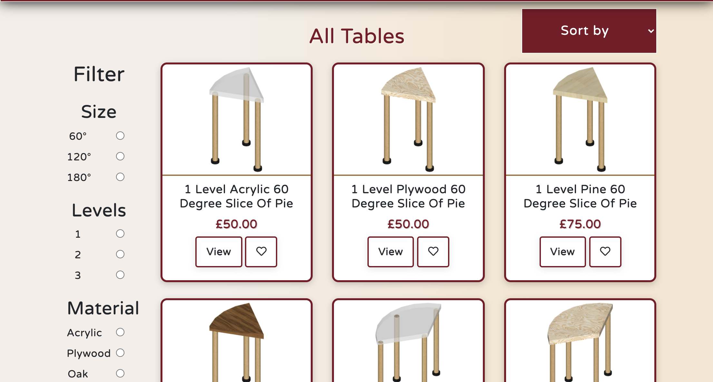

* Subsequent calls to action are placed throughout the homepage directing users to the products page, firstly in the main hero section of the home page for logged in users, then further down on the homepage as in the featured section 

### ***2. I would like to be able to easily filter and sort products by a range of parameters so that I can quickly find what I am looking for.***

* Users are able to filter all the tables by size, amount of levels, and material - and sort all the tables in order of price and amount of levels.

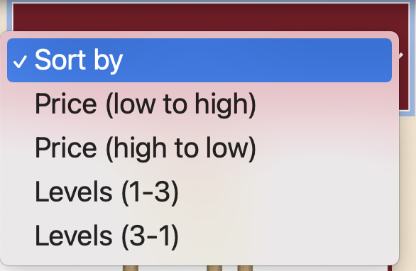
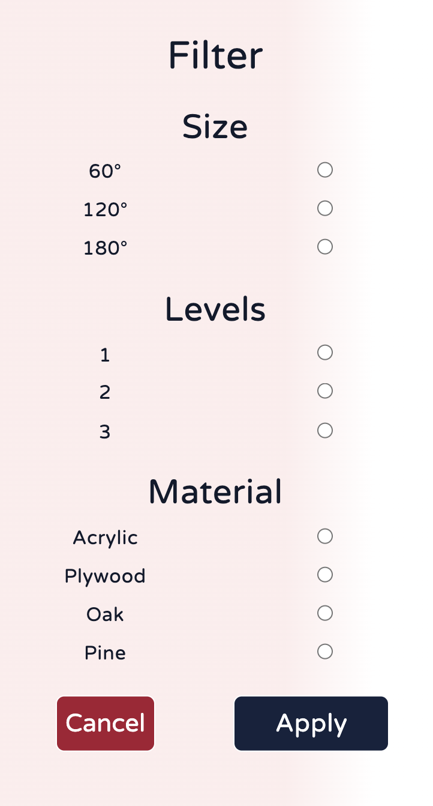

### ***3. I want to see clearly if certain products are not available so that I don’t waste my time putting them in my basket.***

* Unavailable products are clearly marked out as such to provide a visual cue that the user cannot purchase the table at this time.

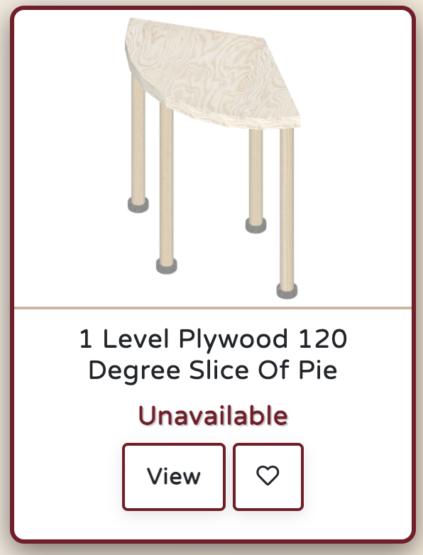

### ***4. I want to be able to add a product to my basket and then keep on browsing or proceed to checkout.***

* Users are able to add products into their basket via the product detail page, which they are directed to either via a product building process or by browsing the all products page.

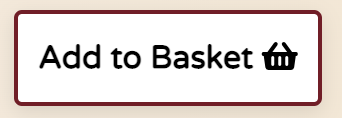

### ***5. I want to be able to remove or amend the quantity of products in my basket easily so that I have the power to change my mind during my journey.***

* It is possible to update the quantity of an item within the sidebar basket or to remove it entirely no matter where you are on the site, before proceeding to checkout.

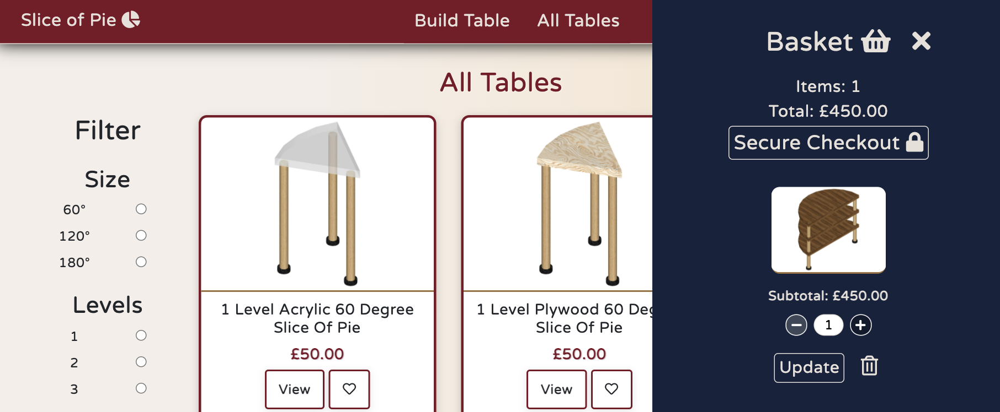

### ***6. I would like to receive visual feedback at every stage of my journey when I perform actions, so that I am sure what I intended to do has in fact taken place.***

* Toast messages split into 3 categories (error, information, success) are displayed at various stages after actions have been performed to confirm to the user that what they had intended to happen has indeed taken place.

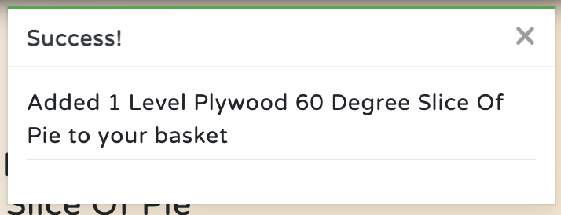

### ***7. I want to be able to complete an order without creating an account so that I don’t need to have my details saved.***

* As it is asking much to have all users create accounts on the site, there are no blockers stopping users from completing a purchase without an account - although there are prompts and calls to action to try and encourage them to sign up during their journey.

### ***8. I would like to register for an account so that I can save my delivery details, and see my order history so that my journey on the site is made easier.***

* One of the more prominent homepage calls to action for non-logged in users is a button directing people to 'Sign Up'.

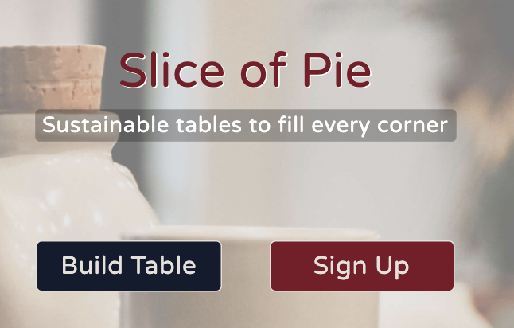

* For users who go through the user journey without already creating account, there is a further reminder of the benefits of creating an account at the checkout stage:

* The account creation process is swift and secure through Django's allauth plugin, prompting users to confirm their email address through a link sent to their inbox.

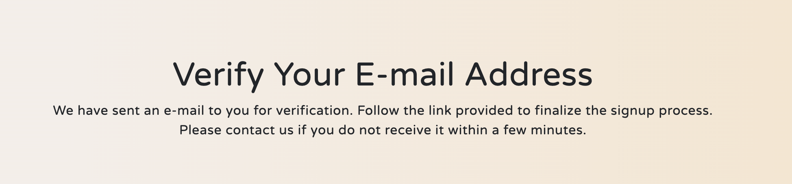

### ***9. As an account holder, I would like to be able to save products in my favourites so that I can decide later whether to proceed with my purchase.***

* Either via the main product cards, or in the product detail page, users can add a product to their wishlist sidebar and store it in the user's session. Products can be added directly into the basket from the wishlist for convenience.

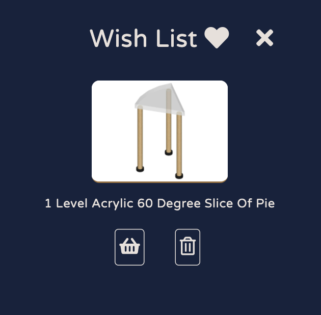

### ***10. As an account holder, I would like to be able to save my delivery details so that checkout is faster during my next purchase.***

* Users who have signed up for an account with Slice of Pie can save their delivery details to their account so that their checkout journey is quicker on the following purchase. 
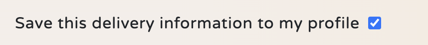

### ***11. As an account holder who has saved their details, I would like to make amends to my saved delivery address so that I can ensure this information is updated accurately.***

* It is easy to update the default delivery address for the user profile simply by navigating to the profile page and updating any of the information available. A toast message is then presented to confirm that this has been saved, and on the next checkout the new details are populated.

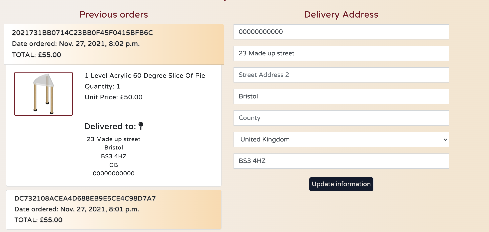

### ***12. At checkout, I would like the payment process to be simple and intuitive so that I don’t waste any time during my journey.***

* Thanks to Stripe, it was possible to have all steps of the checkout process presented on one single page instead of multiple. It is clearly laid out, and the order summary is there in case the user has made a mistake or wishes to make any late changes.

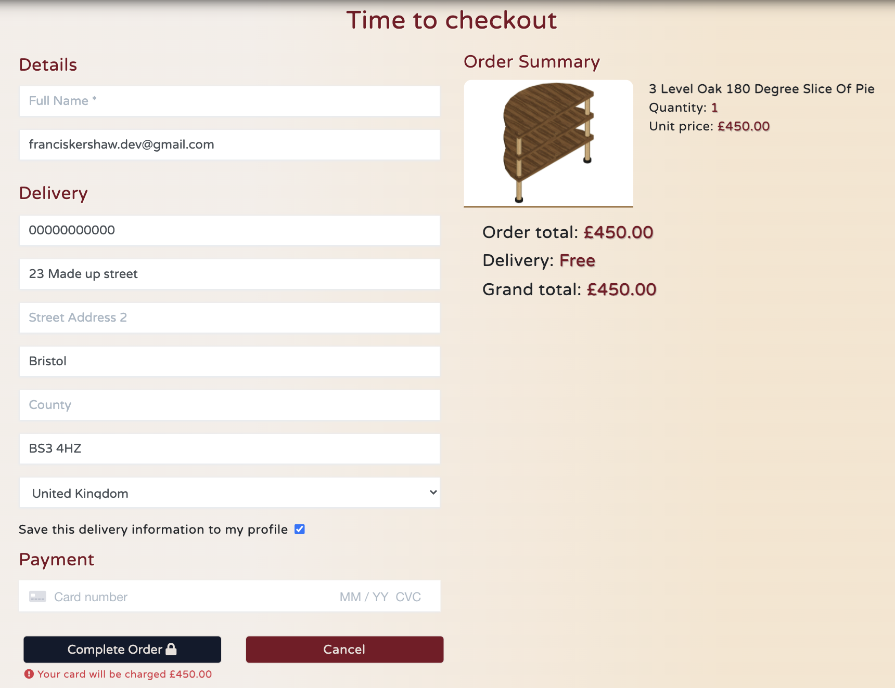

### ***13. At checkout, I would like to be sure that my details are secure during the payment process so that I don’t feel like I’m taking any risks with my money.***

* Stripe payments, one of the most popular and secure online payment systems around, have been implemented on the site and tested thoroughly to ensure that payments were being processed successfully and securely.

* Webhooks are also used on the site in case something goes wrong on the users end during payment. This has led to one fairly noticeable UX bug, which I detailed above in the Notable bugs section.

* Just in case the users were under any illusions about the security of the site, I included the padlock icon in the 'Secure Checkout' button to put customers at ease.

### ***14. After checkout, I would like to receive an order confirmation both on my screen and in my emails so that I can review the purchase and make sure that everything occurred as it was supposed to.***

* Right after a purchase has been successfully completed, the users are directed to an order confirmation page that summarises what has just been purchased.

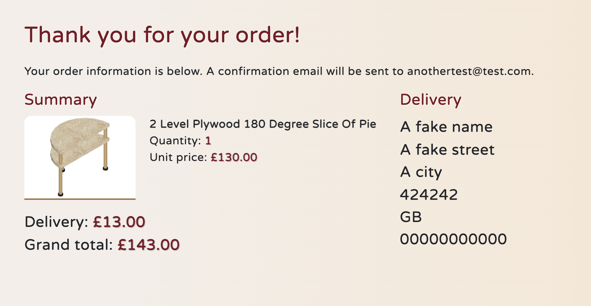

* A confirmation email is also sent out to the user to add an extra layer of confirmation as to what transaction has just taken place.

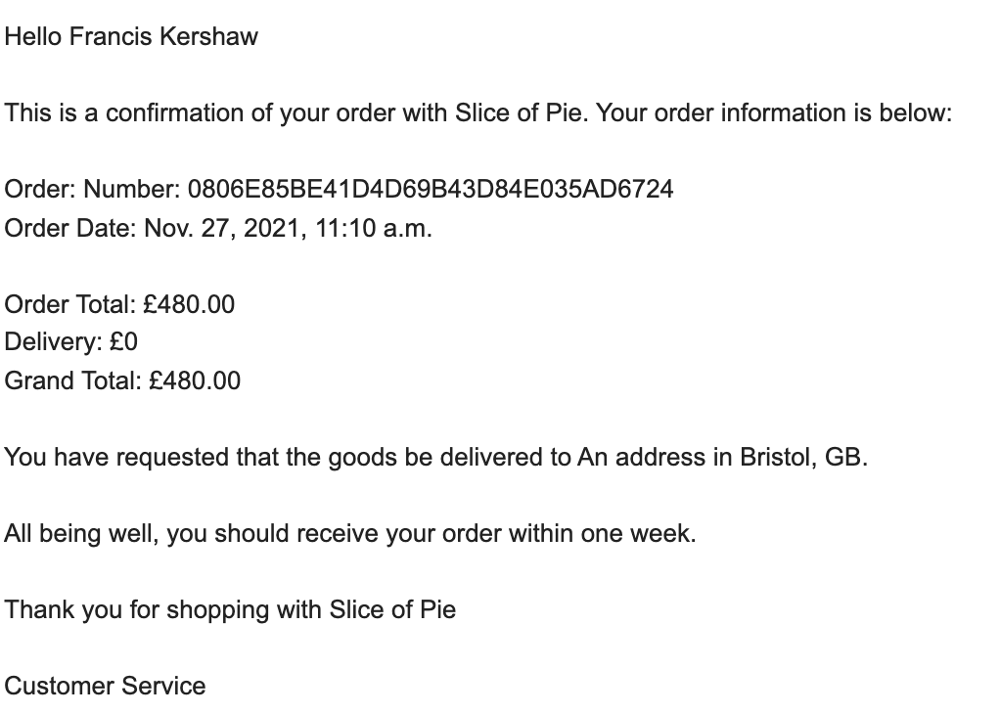

## Manual stakeholder testing

### ***1. I want to have admin access allowing me to add, edit, delete, and amend the availability of products on my online store so that I can keep my product range up to date.***

* For admin users, there is access to the Django backend via the /admin url where changes can be made to the products.

* There is also the option of performing these tasks on the front end by following the link in the profile dropdown, or editing products from the product detail page.

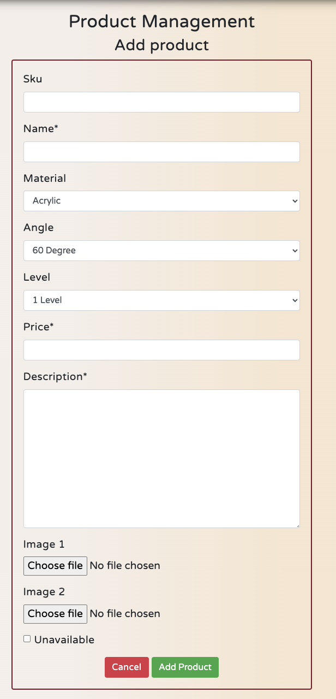

* An option within the add and edit product forms is to make a product unavailable, which will enact changes throughout the site.

### ***2. I would like users to be unable to purchase unavailable products so that I don’t have to go through a refund process.***

* This is mostly covered in user story 2, but I would like to add that basket buttons are disabled when products are unavailable, and checks are made within the python functions to ensure nobody accidentally brute forces a product into their basket.

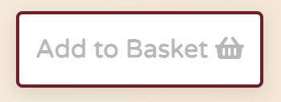

### ***3. I want users to have a product builder which allows them to feel like they are custom building their product as per their preferences so that my store stands out aesthetically compared to competitors.***

* The main feature of the site, which required the most amount of thought and work, is the product builder page, which is able to direct users to their chosen product based off of a number of user choices.

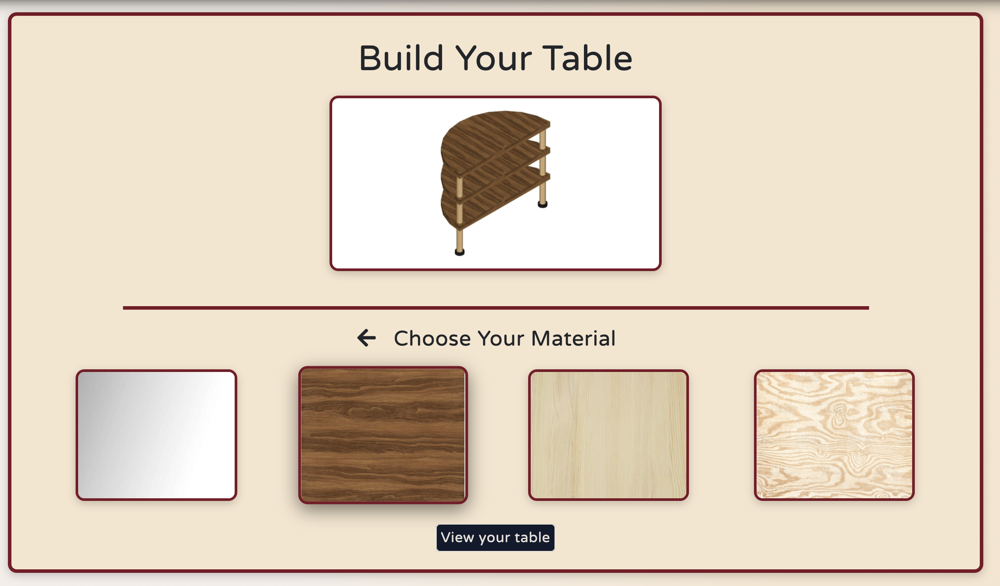

### ***4. I want the site to be as aesthetically pleasing and intuitive as possible so that users are left with a positive emotional response to their visit and are more likely to make a purchase.***

* This is of course subjective, but I have done my level best to ensure a consistent style and theme throughout the site, with animations and hover effects in place to try and ensure a smooth journey for any hypothetical customers.

## Manual Developer Testing

### ***1. I want to create a full-stack online shop on which users can browse and securely make purchases, and site admins have control to add, edit or delete items from the site so that I can pass this part of the course.***

* Please see user story 13 and manual stakeholder testing user story 1

### ***2. I want this project to adequately display the huge progress I've made in the past year by combining all previously learnt languages and frameworks in unison on a fully-functioning and bug free site.***

* I have produced a fully functioning ecommerce store that could in theory begin selling real-life products, employing languages from across the stack in unison with a full stack framework, a far cry from what I was capable of a year ago when I began my coding journey.

## Automated Order Form Test

Django as a full stack framework comes with several tools, one of which is the capability to produce automated unit tests. While most of my testing was done manually and through user testing, I thought it would be beneficial to write at least one test for my order form to absolutely guarantee that the required fields would not fail during an order. I chose this form to focus my limited remaining testing time on as it is the most important form to get right from a user's perspective. We wouldn't want users to accidentally leave out key bits of information for their delivery to take place. 

This was written and saved to *test_forms.py* with the help of the Code Institute's tutorial on writing form tests. Fortunately, the test passed. If I work with Django again on future projects, I would very much like to learn more about how to write very comprehensive unit tests that can at least match the results gained from manual user testing as it clearly has a lot of value as a companion to user testing.

## HTML Validator

The initial run of testing on the W3C html validator displayed a few significant errors that warranted my attention:

* Duplicate ids in the navbar: this was because I had two sets of the same icons displaying depending on the screen size. I wrote some JS to only populate the correct id as per the screen size being used.

* Buttons were children of anchor tags: I had forgotten that this is invalid HTML, so I rewrote the code and corresponding CSS to make sure this was fixed.

* Form and div closing tags clashing with each other: as mentioned earlier, I had attempted to close a form tag before its parent div tag had been closed so that I could fix a bug with my wishlist. This, it turns out, is very invalid as far as the HTML validator is concerned and throws several errors as a result. I rewrote my HTML to separate everything completely and fix the error.

* H1 missing a closing tag: this was a typo, I had amended an h3 into an h1 and forgot to close it off properly.

* Stray closing ` div ` tag present on all pages if items are in the basket: this error drew my attention to the fact that there was indeed a rogue closing div tag in my basket which shouldn't have been there. After a lot of investigating, and nearly considering leaving it unfixed, I realised that my closing `div` needed to move one line up before the closing statement of a condition if loop. Now the validator shows no issues regardless of whether there is an item in the basket.

## CSS Validator

No errors were found when running my CSS through the W3C CSS validator.

## JS Validator

Using JSHint, I found that there were no critical errors in my written code. There were a few warnings displayed to do with a few missing or unnecessary semicolons, which were promptly rectified. I had also forgotten the keyword *let* for some of my *for of* statements. These coincidentally were the same errors brought to my attention last time I used JSHint, so going forward I'll be more weary of these syntax errors.

## PEP8 Compliance

To check my python code complied with industry standards, I first rendered a list of all warnings in my workspace using the `python3 -m flake8 ` command. I disregarded all warnings from migration files and proceeded to work through every problem one by one. The vast majority were warnings about the line length, which were fixed by adding parentheses and moving onto another line.

I then double checked everything by running each file through Pep8 online, with no major errors being found. As with the flake8 linter in GitPod, warnings were made regarding the length of certain lines in my settings.py file, but as these were for important configuration settings I elected to leave them as they were. One line in my webhooks file was producing a warning regarding indentation, but changing it broke the functionality so I repositioned it back to where it was before.

## Accessibility Testing

Using the WAVE Accessibility Evaluation Tool, I was fortunate to find that on this occasion no colour contrast issues were present. There were a few minor warnings but nothing urgent that needed rectifying.

## Google Lighthouse

Using Google's lighthouse feature, I was able to assess the performance of the site. All pages were working to a good standard, however issues with image size were highlighted. I compressed these using TinyJPG to help improve speed a bit.

The overall performance (especially on mobile) has plenty of room for improvement on future iterations of the site, and I think more research needs to be done on my end for how to render the large amounts of images required on the site in a more efficient way.

[Back to the top](#testing)

[Back to main document](README.md)
