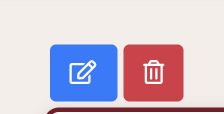

# Testing

Click [here](README.md) to return to the main project documentation.

Testing of this project was carried out through the following methods:

* Constant review during development using Gitpod's browser previewers and Chrome developer tools.
* User testing of the deployed site when close to completion.
* Manual user story testing during and after the writing of the code.
* Python unit tests
* Automated testing of the HTML and CSS files using the WC3 validators.
* Automated testing of the JavaScript and Python files using JSHINT and PEP8 Online respectively.
* Automated testing of the site's accessibility using the WAVE accessibility tool.
* Automated testing of the site's general performance through Google's lighthouse feature.

As per my previous projects, I attempted to stick to agile principles by using Trello to make sure that the project was first built to its most simple iteration - breaking large sections of the code to be written into sprints, with those sprints further broken up into individual tasks to be completed. Each completed task would then usually be assigned to its own git commit so that I had the option to revert to working versions of the code if my site was to break for an unknown reason.

## Table of Contents

* [Testing During Development](#testing-during-development)
   * [Browser Preview and Chrome Developer Tools](#browser-preview-and-chrome-developer-tools)
   * [Post Deployment](#post-deployment)
   * [Notable Bugs](#notable-bugs)
* [User Story Testing](#manual-user-story-testing)
* [Stakeholder Story Testing](#manual-stakeholder-testing)
* [Developer Testing](#manual-developer-testing)
* [Python unit tests](#python-unit-tests)
* [HTML Validator](#html-validator)
* [CSS Validator](#css-validator)
* [JS Validator](#js-validator)
* [PEP8 Compliance](#pep8-compliance)
* [Accessibility Testing](#accessibility-testing)
* [Google Lighthouse](#google-lighthouse)

## Testing During Development

### Browser Preview and Chrome Developer Tools

Visuals/Responsiveness

* By running ` python3 manage.py runserver `, I was able to constantly test the front end visuals of the site in order to make sure that elements and styles were being displayed as intended.
* While on the temporary browser previews, Google Chrome's developer tools were always in use to check the responsiveness of my pages across a number of screen sizes.

Logic

Following on from my previous projects, I made sure I continued with the process I had settled on when developing both the JavaScript functions and the Python back end logic for my site - that is to say start small and build up, making sure to check the console and print statements at all stages to ensure that the right results are being reached. Environment variables were also used to ensure that none of the sensitive secret keys were pushed to GitHub. *Note, I did at one point early on in development I did accidentally push my Postgres url to GitHub - however I replaced it with a new one by the end to ensure the security of the project was not compromised.*

I started by building the most basic version of the back end, with placeholders providing the bare minimum content required to have a functioning site on the front end. This allowed me to focus fully on getting all of the core back end logic working properly as the scope of this project and Django in general is so large. Only once I felt confident that all of my apps were working proplery, and that the complicated process of deploying and linking to AWS was complete, did I full focus on building out the front end of the site.

There were inevitably several interesting bugs that needed attention, for more information please see the 'notable bugs' section below.

### Post Deployment

As this project depended almost entirely on the ability of users to interact with the website from the perspective of prospective paying customers, it was incredibly important to get feedback from user testing. With that in mind, I sent the live version of the website to 10 people with the following directives, leaving out specific instructions of *how* to achieve what the site could do to check that it was intuitive enough:

1. Create an account, confirm email address, sign back in.
2. Build a table.
3. View other tables that you haven't built.
4. Attempt to purchase a table using the dummy payment information provided by Stripe
5. Provide me with general feedback and let me know what device and browser was being used.

This defined structure for user testing helped me focus my testers to test the integral parts of the site and answer the following questions:

1. Is my site intuitive enough to use very quickly?
2. Do all of my backend functions work outside of my own development environment and tools?
3. Is there anything at all not working as it should do?

Overall, I felt that questions 1-2 were answered with a yes as the general feedback was positive with regard to the ease of use on the site - and users were successfully able to complete their journeys. There were however a few bugs and general UX issues brought to my attention, which I will detail below. Some were fixed in time for submission, however with the lack of time available before the deadline there were some left unfixed for now which I explain in a section further down.

### Notable bugs

This being only my second full stack website, and first using a MVC framework, there were inevitably plenty of bugs to sink my teeth into throughout development of this project, found during the building of the site and from user testing:

#### Fixed

*Stripe webhooks error*

*Navbar profile dropdown button error*

*Save for later button on product detail page adding to basket instead of wishlist*

*500 server error when removing items from wishlist*

*Product builder resizing issues*

*Delivery cost  being multiplied instead of taking a percentage of*

#### Outstanding bugs

*Safari breaks navbar when items are in the basket*

*Favouriting festivals on browse.html refreshes the page and loses pagination*

*500 error when sorting a filtered selection*

*Duplicate orders on the live version of the site*

## Manual User Story Testing

Testing my own user stories was carried out using the following criteria:

* The user journey must be intuitive.
* The user must reach the end of their journey in as few clicks as possible.

### ***1. I want to be able to browse available products so that I can see if there’s anything I want to buy.***

* From the moment you reach the homepage, the user is provided the option to view *All Tables* in the navbar which directs them to the products page.

* Subsequent calls to action are placed throughout the homepage directing users to the products page, firstly in the main hero section of the home page for logged in users, then further down on the homepage as in the featured section 

### ***2. I would like to be able to easily filter and sort products by a range of parameters so that I can quickly find what I am looking for.***

* Users are able to filter all the tables by size, amount of levels, and material - and sort all the tables in order of price and amount of levels.

### ***3. I want to see clearly if certain products are not available so that I don’t waste my time putting them in my basket.***

* Unavailable products are clearly marked out as such to provide a visual cue that the user cannot purchase the table at this time.

### ***4. I want to be able to add a product to my basket and then keep on browsing or proceed to checkout.***

* Users are able to add products into their basket via the product detail page, which they are directed to either via a product building process or by browsing the all products page.

### ***5. I want to be able to remove or amend the quantity of products in my basket easily so that I have the power to change my mind during my journey.***

* It is possible to update the quantity of an item within the sidebar basket or to remove it entirely no matter where you are on the site, before proceeding to checkout.

### ***6. I would like to receive visual feedback at every stage of my journey when I perform actions, so that I am sure what I intended to do has in fact taken place.***

* Toast messages split into 3 categories (error, information, success) are displayed at various stages after actions have been performed to confirm to the user that what they had intented to happen has indeed taien place.

### ***7. I want to be able to complete an order without creating an account so that I don’t need to have my details saved.***

* As it is asking much to have all users create accounts on the site, there are no blockers stopping users from completing a purchase without an account - although there are prompts and calls to action to try and encourage them to sign up during their journey.

### ***8. I would like to register for an account so that I can save my delivery details, and see my order history so that my journey on the site is made easier.***

* One of the more prominent homepage calls to action for non-logged in users is a button directing people to 'Sign Up'.

* For users who go through the user journey without already creating account, there is a further reminder of the benefits of creating an account at the checkout stage:

* The account creation process is swift and secure through Django's allauth plugin, prompting users to confirm their email address through a link sent to their inbox.

### ***9. As an account holder, I would like to be able to save products in my favourites so that I can decide later whether to proceed with my purchase.***

* Either via the main product cards, or in the product detail page, users can add a product to their wishlist side bar and stored in the user's session. Products can be added directly into the basket from the wishlist for convenience.

### ***10. As an account holder, I would like to be able to save my delivery details so that checkout is faster during my next purchase.***

* Users who have signed up for an account with Slice of Pie can save their delivery details to their account so that their checkout journey is quicker on the following purchase. 

### ***11. As an account holder who has saved their details, I would like to make amends to my saved delivery address so that I can ensure this information is updated accurately.***

* It is easy to update the default delivery address for the user profile simply by navigating to the profile page and updating any of the information available. A toast message is then presented to confirm that this has been saved, and on the next checkout the new details are populated.

### ***12. At checkout, I would like the payment process to be simple and intuitive so that I don’t waste any time during my journey.***

* Thanks to Stripe, it was possible to have all steps of the checkout process presented on one single page instead of multiple. It is clearly laid out, and the order summary is there in case the user has made a mistake or wishes to make any late changes.

### ***13. At checkout, I would like to be sure that my details are secure during the payment process so that I don’t feel like I’m taking any risks with my money.***

* Stripe payments, one of the most popular and secure online payment systems around, have been implemented on the site and tested thoroughly to ensure that pyayments were being processed successfully and securely.

* Webhooks are also used on the site in case something goes wrong on the users end during payment. This has led to one fairly noticeable UX bug, which I detailed above in the Notable bugs section.

* Just in case the users were under any illusions about the security of the site, I included the padlock icon in the 'Secure Checkout' buton to put customers at ease.

### ***14. After checkout, I would like to receive an order confirmation both on my screen and in my emails so that I can review the purchase and make sure that everything occurred as it was supposed to.***

* Right after a purchase has been successfully completed, the users are directed to an order confirmation page that summarises what has just been purchased.

* A confirmation email is also sent out to the user to add an extra layer of confirmation as to what transaction has just taken place.

## Manual stakeholder testing

### ***1. I want to have admin access allowing me to add, edit, delete, and amend the availability of products on my online store so that I can keep my product range up to date.***

* For admin users, there is access to the Django backend via the /admin url where changes can be made to the products.

* There is also the option of performing these tasks on the front end by following the link in the profile dropdown, or editing products from the product detail page.

* An option within the add and edit product forms is to make a product unavailable, which will enact changes throughout the site.

### ***2. I would like users to be unable to purchase unavailable products so that I don’t have to go through a refund process.***

* This is mostly covered in user story 2, but I would like to add that basket buttons are disabled when products are unavailable, and checks are made within the python functions to ensure nobody accidentally brute forces a product into their basket.

### ***3. I want users to have a product builder which allows them to feel like they are custom building their product as per their preferences so that my store stands out aesthetically compared to competitors.***

* The main feature of the site, which required the most amount of thought and work, is the product builder page, which is able to direct users to their chosen product based off of a number of user choices.

### ***4. I want the site to be as aesthetically pleasing and intuitive as possible so that users are left with a positive emotional response to their visit and are more likely to make a purchase.***

* This is of course subjective, but I have done my level best to ensure a consistent style and theme throughout the site, with animations and hover effects in place to try and ensure a smooth journey for any hypothetical customers.

## Manual Developer Testing

### ***1. I want to create a full-stack online shop on which users can browse and securely make purchases, and site admins have control to add, edit or delete items from the site so that I can pass this part of the course.***

* Please see user story 13 and manual stakeholder testing user story 1

### ***2. I want this project to adequately display the huge progress I've made in the past year by combining all previously learnt languages and frameworks in unison on a fully-functioning and bug free site.***

* I have produced a fully functioning ecommerce store that could in theory begin selling real-life products, employing languages from across the stack in unison with a full stack framework, a far cry from what I was capable of a year ago when I began my coding journey.

## Python Unit Tests

## HTML Validator

The initial run of testing on the W3C html validator displayed a few errors and warning that warranted my attention:

* 

* 

* 

* 

## CSS Validator

No errors were found when running style.css through the W3C CSS validator.

## JS Validator

Using JSHint, I found that there were no critical errors in my written code. There were a few warnings displayed to do with a few missing or unnecessary semicolons, which were promptly rectified. I had also forgotten the keyword *let* for some of my *for of* statements, which I attribute to my recent introduction to Python and its lack of keywords in for loops.

## PEP8 Compliance

No errors were found when running my Python code through the PEP8 online service. There remained one warning on the GitPod linter about over indention which was only brought about by shortening the line. The function worked exactly as intended and as no errors were thrown by PEP8 online, I deemed this ok to leave.

## Accessibility Testing

Using the WAVE Accessibility Evaluation Tool, I found the following errors and warnings worthy of attention:

## Google Lighthouse

Using Google's lighthouse feature, I was able to assess the performance of the site. All pages were working to a good standard, however issues with image size were highlighted. I compressed these using TinyJPG to help improve speed a bit. This was not possible for the images being rendered by URL link, but on future iterations of the site I'd like to use direct upload for these images which will help significantly.

The overall performance of the site (especially on mobile) has plenty of room for improvement on future iterations of the site, as dependency on Bootstrap among other things won't have helped with the speed.

[Back to the top](#testing)

[Back to main document](README.md)

## Notes pasted from README document

#### Bugs

Stripe: typos in my webhook handlers caused 500 errors
Navbar: profile button dropdown stopped working (was because navbar-links had overflow set to hidden)
500 server error when removing items from wishlist (had same class name as basket which meant an undefined variable was in the url)
Product builder resizing issues
Save for later button on product details page was sending items into basket instead of wishlist - buttons were both in the same form
Sort/filter clash - 500 error when sorting to a filtered selection, fixed by clearing the search paramaters in js so that it just sorts from all available products
Delivery cost: missing / 100 in logic which meant my delivery was being multiplied by 5 instead of adding 5%

unsolved bugs:

duplicate orders in profile page

HTML validator:
* stray closing div tag in the basket html page
* clashing id and 'aria-labeledby' on navbar dropdown (unsolved as it breaks the site to remove it)
* buttons were children of a tags
* Form and div closing were overlapping on product detail
* closing h3 tag was still an h1 on the create account page

CSS validator:
* no errors

JS Hint
* semicolons and missing 'let' in for of loops

Pep 8
used the command python3 -m flake8 to get a full list of problems, disregarded migrations, and went through each file to make lines shorter. A few exceptions but mostly compliant.
Pep 8 validator
One error on webhooks.py about indentation, changing it causes the code to fail
Errors shown for long lines in settings but they cannot be shortened so are left

Lighthouse
* No major perforamce issues - compressed all images across the site to help (espeically for the all products page which has more content to load)

Wave - not major accessibility errors or color contrasting errors.

https://stackoverflow.com/questions/44922492/keep-element-fixed-while-safari-navigation-bar-collapes-on-ios - safari navbar issue

